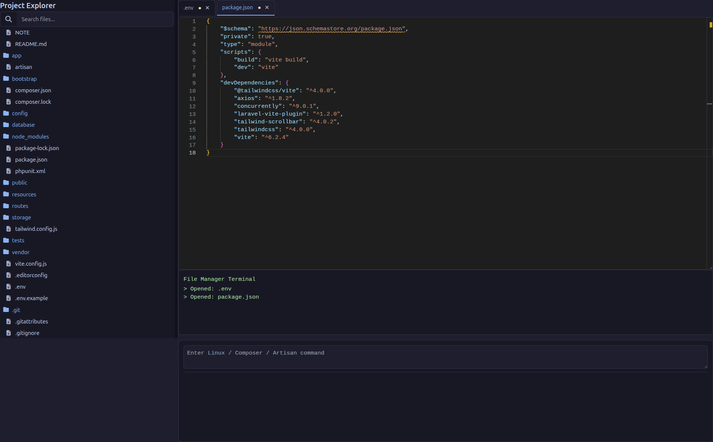

# Laravel Code Editor

A powerful code editor with Monaco editor, terminal, and file tree for Laravel applications.

## Features

- 🗂️ File tree explorer with search
- 📝 Monaco code editor with syntax highlighting
- 💾 Save files with keyboard shortcut (Ctrl+S)
- 🖥️ Built-in terminal for running commands
- 🎨 Dark theme by default
- 📁 Multiple file tabs support
- 🔍 Search files in tree
- 🚫 Exclude vendor/node_modules from search
- 🔒 Secure file access control

## Requirements

- PHP 7.4 or higher
- Laravel 8.0 or higher
- Laravel Authentication setup (Laravel UI, Jetstream, Breeze, or custom)


## Installation
### Step 1: Install via Composer


```bash
composer require monirujjaman27/laravel-code-editor

# Publish config
php artisan vendor:publish --tag=code-editor-config

# Publish views (optional)
php artisan vendor:publish --tag=code-editor-views

# Clear cache
php artisan optimize:clear

# Test the editor
php artisan serve
# Visit: http://localhost:8000/code-editor
```
### Code Editor Interface
